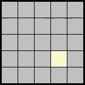

# Lights-Out
Lights Out! is a game that played on a 5 by 5 grid of tiles that can either be on or off. When you click on a tile, it and its neighbors will flip states. The lit tiles will turn off and off tiles will turn on. The goal of the game is to turn all the lights off. This game requires the pygame package and use the lightoutsrand.py to have a random starting state to be solved. Happy gaming!
